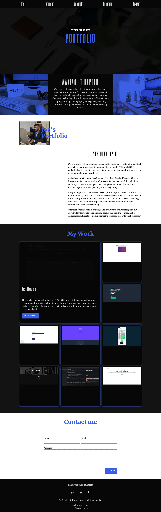

# Portfolio

Welcome to my portfolio website repository!

Check out the live version of my portfolio:

[LiveURL: ](https://joeehis1.github.io/portfolio-v2/)

This website is based on a design that I created, drawing heavy inspiration from the work of my CSS mentor, Kevin Powell. You can view the design prototype on [!Figma](https://www.figma.com/file/VL3hWBdECw5iZFDZgylXq3/Untitled?type=design&t=vLHZxRoUe35lTu5y-6.) Please note that I made some last-minute changes that are not reflected in the design file.

## Technologies Used

The CSS for this project was written using Sass for enhanced convenience, leveraging features like nesting, modular styling, and mixins.

## Features

-   Responsive Design: The navigation section is revealed by clicking on a button in the top left corner of the page. Smooth scrolling ensures a seamless transition between sections on both mobile and desktop versions of the website.

-   Portfolio Projects Section: Each project in the portfolio includes a modal that provides a summary of the project. Users can access the project's repository URL, the deployed website, or close the modal to explore other projects listed. The portfolio section, referred to as Gallery in the JS files, utilizes two classes—one for the portfolio itself and one for the modal. Additionally, a keyboard event listener allows users to close the modal by pressing the 'Esc' key when it's open.

-   Contact Form: The contact form functionality is powered by the Web3Forms API, enabling users to send emails upon submission. Helpful messages are included to guide users through any issues encountered while filling out the form.

Screenshots of the site for mobile and desktop are included below:

## Projects Showcase

The portfolio showcases a variety of projects, each demonstrating the different technologies I've mastered on my journey toward becoming a proficient software developer, with a focus on frontend technologies.

Thank you for visiting my portfolio!
